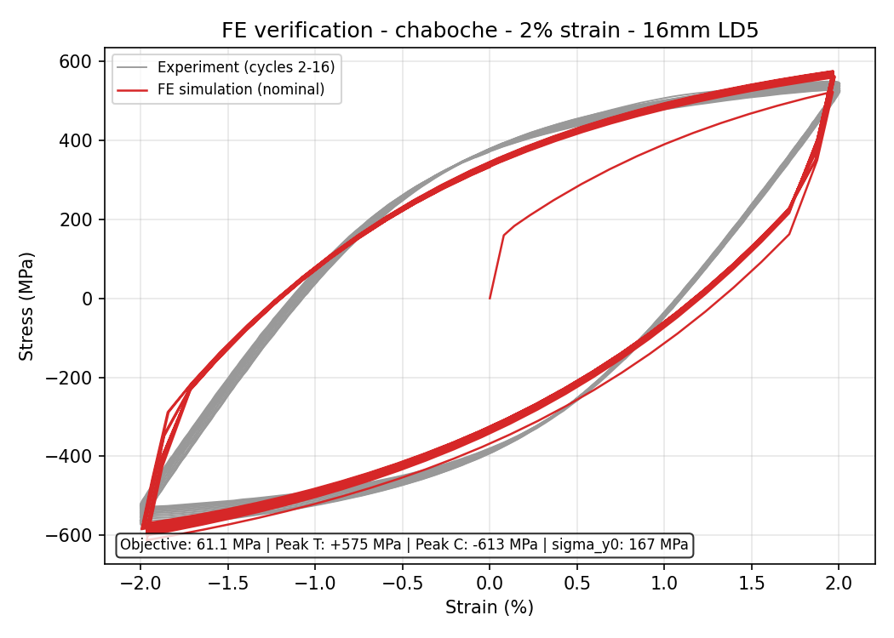
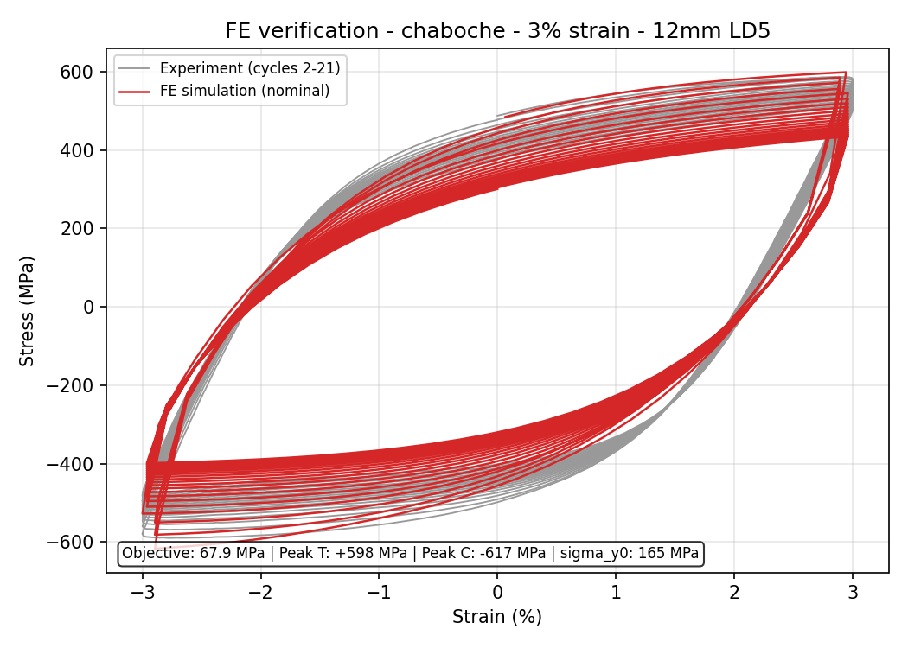

# Cyclic-Plasticity Calibration for Reinforcing-Bar Low-Cycle Fatigue

A calibration and FE-verification pipeline that fits cyclic-plasticity
constitutive models to strain-controlled low-cycle-fatigue (LCF) hysteresis
data, then verifies every fit against a real ABAQUS solve — surrogate and
finite-element results held to the *same* objective function throughout.

**Context.** The real target is locally-manufactured (scrap-metal) rebar of
unknown, batch-variable grade, so the whole pipeline is **grade-agnostic**:
yield stress and parameter bounds are per-run inputs, and the physical-validity
gate checks consistency against whatever data is loaded, never a hard-coded
steel grade. This repository validates the pipeline against the open Kashani
et al. (2019) B500C dataset before it is pointed at the real material.

<p align="center">
  
  
</p>

<p align="center"><em>Left: calibrated Chaboche model transferred into a full ABAQUS
coupon simulation, 2% strain amplitude — surrogate 69.2 MPa vs FE 61.1 MPa
objective, essentially the same fit. Right: 3% strain — the surrogate (48.9 MPa)
and FE (67.9 MPa) diverge because strain localisation (barrelling) at the higher
amplitude is a structural effect a single-element surrogate cannot see; this gap
is diagnosed, not hidden — see "What the FE check is actually for" below.</em></p>

## Why this exists

Constitutive-model calibration is usually reported as a single number (RMSE)
against a hand-picked parameter set. This project treats calibration as an
optimisation + verification *pipeline*:

1. Any of three published cyclic-plasticity models can be dropped in behind an
   identical interface — no optimiser or UI code changes.
2. Every model is calibrated against a fast Python surrogate, then the winning
   parameter set is **re-run inside real ABAQUS** (single-element for search-time
   checks, full 3-D coupon for final verification) and scored with the *same*
   objective — so a good surrogate fit that doesn't survive contact with a real
   finite-element solve is caught, not assumed away.
3. A physics gate rejects/repairs parameter combinations that are numerically
   fine but not physically meaningful (see below) before they ever reach ABAQUS.

## Models implemented

| Model | Reference | ABAQUS-native? | Backstresses |
|---|---|---|---|
| Chaboche combined isotropic/kinematic | Chaboche (1986), *Int. J. Plasticity* 2:149-188 | Yes (`*PLASTIC, HARDENING=COMBINED`) | 2 / 3 / 4 |
| Updated Voce-Chaboche (UVC) | Hartloper, de Castro e Sousa & Lignos (2021), *J. Struct. Eng.*, [doi:10.1061/(ASCE)ST.1943-541X.0002964](https://doi.org/10.1061/(ASCE)ST.1943-541X.0002964) | No — user material | 2 / 3 / 4 |
| Ohno-Wang model I + Voce isotropic extension | Ohno & Wang (1993), *Int. J. Plasticity* 9(3):375-390 | No — user material | 2 / 3 / 4 |

Chaboche is ABAQUS-native; UVC and Ohno-Wang are not, and this machine has no
Intel Fortran compiler (ABAQUS's official user-subroutine route). Both are
implemented as **C++ user materials compiled with MSVC** instead — the finite
element backend, the "known-hard" part of this project, is described in
[`calibration_app/umats/`](calibration_app/umats/). Every C++ port was
cross-validated against its Python surrogate to **0.0000 MPa** difference on
identical strain paths before being trusted for FE verification.

## Pipeline

```
Stage 1  Sobol space-filling search of the parameter box (replaces grid search,
         which is combinatorially infeasible past ~6 free parameters)
Stage 2  Refinement — Differential Evolution or Bayesian/TPE (Optuna)
Stage 3  ABAQUS verification of the winning candidate (single element, then
         optionally the full 3-D coupon via "Transfer to CAE")
```

Backend (Surrogate / FE) and optimiser (DE / Bayesian) are independent axes —
all four combinations are directly comparable because they share one objective:
a per-cycle weighted RMSE (`core/objective.py`), reversal regions weighted
1.5x, with the first loaded cycle excluded from scoring but retained as a
burn-in path so the model's internal state is already conditioned when scoring
starts.

## A physics gate, not just a numerical fit

A parameter set can minimise RMSE while being unphysical — three backstresses
collapsing to the same relaxation rate (an over-parameterised single
backstress in disguise), or a saturated-yield floor implying more cyclic
softening than the material can plausibly sustain. `utils/physics_gate.py`
enforces, for any model using a Chaboche-style backstress decomposition:

* **γ-separation**: `γ_k / γ_{k+1} ≥ 3` (Chaboche 1986 Eq. 5's own
  multi-timescale rationale; Bari & Hassan 2000) — added after a real fit on
  this dataset collapsed all three γ's to within 0.01 of each other.
* A saturated-yield floor tied to the *loaded* data's measured peak stress,
  not a hard-coded material constant — this is what keeps the whole pipeline
  grade-agnostic.

Violations are repaired by projection where possible and otherwise rejected
before the candidate is ever sent to ABAQUS.

## What the FE check is actually for

The right-hand figure above is the interesting result, not a failure to hide.
At 3% strain amplitude the calibrated model matches the *surrogate* well, but
the full 3-D coupon shows an 8%+ local-vs-nominal strain gap — barrelling /
incipient localisation that a single-element surrogate structurally cannot
represent. Decomposing the gap (documented in `docs/literature-review.md` and
the session notes) showed the geometric engineering-vs-true-stress convention
accounts for only ~1 MPa of it; the rest is genuinely structural. That is
exactly the class of finding a surrogate-only calibration would never surface —
which is the reason this pipeline runs the real solver at all.

## Repository layout

```
calibration_app/
  core/
    surrogate.py          CyclicPlasticityModel base + N-backstress Chaboche
    uvc_model.py           Updated Voce-Chaboche surrogate (fixed-branch Newton)
    ohno_wang_model.py     Ohno-Wang I + Voce isotropic, substepped integrator
    objective.py           shared scorer (surrogate + FE), engineering strain
    abaqus_runner.py       FE-in-the-loop backend (single-element jobs)
    cae_transfer.py        pushes a calibrated fit into a full 3-D ABAQUS coupon
    search.py              Sobol seeding + Differential Evolution + Optuna
    data_loader.py         strain autodetection, gauge-length derivation
    pipeline.py            run orchestration
  utils/physics_gate.py    grade-agnostic physical-validity gate
  session/                 crash-safe checkpointing, session browser
  ui/                      Tkinter GUI (live plot, verification table, themes)
  umats/                   C++ user materials (UVC, Ohno-Wang) + MIT-licensed
                           Fortran reference implementations
docs/
  literature-review.md     model-selection literature survey with confidence
                           ratings and citations (Chaboche/Ohno-Wang/UVC/etc.)
  ohno-wang-model-reference.md  full equation reference used to derive the
                           surrogate and UMAT integrators
  kashani-2019-dataset.md  validation-dataset methodology summary
  results-table.md         calibrated parameters + active-constraint audit
                           for the sessions behind the figures above
scripts/
  run_calibration_headless.py  reproducible GUI-free re-runs
  export_paper_table.py        parameter/results table generator
  plot_fe_comparison.py        standalone ABAQUS-Python post-run comparison
figures/                   the two verification plots shown above
```

## Running it

```bash
pip install -r requirements.txt
python -m calibration_app.main
```

The GUI backend needs `tkinter` (standard on most Python distributions). The
FE-in-the-loop backend and "Transfer to CAE" additionally require a licensed
ABAQUS 2024 install and, for the UVC / Ohno-Wang user materials, an MSVC C++
toolchain — see `calibration_app/umats/` for the compile chain.

## What isn't in this repository, and why

* **`input_data/`** — the Kashani et al. (2019) Bristol dataset is openly
  available at its own DOI (below); it isn't re-hosted here.
* **`calibration_sessions/`** — full run history (ABAQUS `.odb`/`.inp` files,
  per-evaluation logs) is gigabytes per session and specific to a local
  machine; the two figures and `docs/results-table.md` are the curated summary.
* **`FATIGUE.cae` / `FATIGUE_rebuilt.cae`** — proprietary-format ABAQUS binaries
  with no value outside a licensed ABAQUS install; `cae_transfer.py` documents
  and regenerates everything they contain.

## Citations

* Kashani, M.M., Cai, S., Davis, S.A. & Vardanega, P.J. (2019). "Influence of
  Bar Diameter on Low-Cycle Fatigue Degradation of Reinforcing Bars." *J. Mater.
  Civ. Eng.* 31(4). [doi:10.1061/(ASCE)MT.1943-5533.0002637](https://doi.org/10.1061/(ASCE)MT.1943-5533.0002637)
  — dataset: [doi:10.5523/bris.1kz5015zjoel92ueb97kwxd4ps](https://doi.org/10.5523/bris.1kz5015zjoel92ueb97kwxd4ps)
* Chaboche, J.L. (1986). "Time-independent constitutive theories for cyclic
  plasticity." *Int. J. Plasticity* 2(2):149-188.
* Ohno, N. & Wang, J.D. (1993). "Kinematic hardening rules with critical state
  of dynamic recovery, Part I." *Int. J. Plasticity* 9(3):375-390.
* Hartloper, A., de Castro e Sousa, A. & Lignos, D.G. (2021). "Constitutive
  Modeling of Structural Steels: Nonlinear Isotropic/Kinematic Hardening
  Material Model and Its Calibration." *J. Struct. Eng.* 147(4).
  [doi:10.1061/(ASCE)ST.1943-541X.0002964](https://doi.org/10.1061/(ASCE)ST.1943-541X.0002964)
  — UMAT reference: [github.com/ahartloper/UVC_MatMod](https://github.com/ahartloper/UVC_MatMod)
* Bari, S. & Hassan, T. (2000). "Anatomy of coupled constitutive models for
  ratcheting simulation." *Int. J. Plasticity* 16(3-4):381-409.

Full literature survey with per-claim confidence ratings: `docs/literature-review.md`.

## License

MIT — see `LICENSE`. The UVC user-material files under `calibration_app/umats/`
carry their own MIT attribution to the original authors (see `LICENSE` and
`calibration_app/umats/UVC_LICENSE_MIT.txt`).
